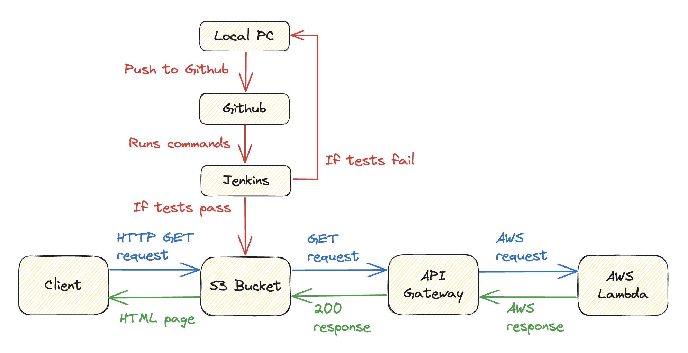

# CI/CD Pipeline with Serverless AWS Deployment

## Project Overview

Refinement and Deployment of a Web Project with Serverless Backend Integration.

## Project Description

The core objective of this project was to rectify existing errors, deploy an HTML file to an S3 bucket, and integrate a serverless backend using AWS Lambda, triggered by a button click on the webpage.

## Stages & Tasks

**1. Initial Setup:**
- Forked the provided project from Github and established a personal repository.
- Initialized an S3 bucket with static website hosting capabilities and uploaded a preliminary 'Hello World!' HTML file.

**2. Jenkins Server & Pipeline Configuration:**
- Utilized CloudFormation with the given configuration file to provision a Jenkins server on AWS EC2.
- Installed Java and Jenkins on the EC2 instance.
- Configured the Jenkins pipeline utilizing a provided script.
- Generated a restricted personal access token on Github for Jenkins integration.
    - Permissions granted:
        - Commit statuses: Read & Write.
        - Contents: Read-only.
        - Metadata: Read-only.

**3. Pipeline Debugging & Iteration:**
- Initial pipeline execution revealed HTML errors.
- Iteratively rectified the HTML issues and committed the changes to Github.
- Addressed AWS deployment stage failure by:
    - Setting up a specific IAM user group and user in AWS, adhering to the principle of least privilege.
    - Securely integrated the AWS Access Key ID and Secret Access Key with Jenkins.

**4. Pipeline Automation & Debugging:**
- Implemented a webhook in Github to trigger the Jenkins pipeline automatically upon code push.
- Resolved an unforeseen issue where Git was missing on the Jenkins instance by installing it.

**5. Serverless Backend Integration:**
- Set up an AWS Lambda function, integrated the given code, and validated its performance.
- Established an API gateway and connected it to the Lambda function.
- Modified the index.html to invoke the Lambda function via the API gateway when the button is clicked.
- Addressed CORS-related issues to ensure smooth interactivity between the webpage and the Lambda function.

## Conclusion

This project was both challenging and rewarding, offering a comprehensive exploration into CI/CD pipelines, AWS services, and serverless backend integration. My experience with AWS Lambdas and API gateways has opened up new avenues for scalable and efficient backend solutions, which I am eager to delve deeper into in the future.